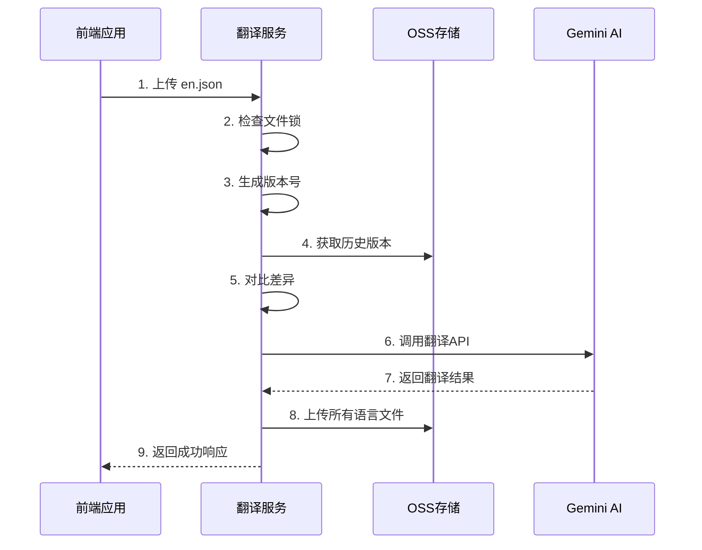

# 多语言翻译服务

智能多语言翻译管理系统，基于 Google Gemini AI 的自动化翻译服务，支持版本管理、队列处理、OSS 云存储。

---

## 目录
- [项目简介](#项目简介)
- [核心架构](#核心架构)
- [主要特性](#主要特性)
- [快速开始](#快速开始)
- [环境配置](#环境配置)
- [API 接口](#api-接口)
- [前端集成流程](#前端集成流程)
- [核心功能详解](#核心功能详解)
- [常见问题](#常见问题)

---

## 项目简介

多语言翻译服务是一个基于 AI 的智能翻译管理系统，专为多语言应用设计。系统通过 Google Gemini API 实现自动化翻译，支持版本管理、队列处理、OSS 云存储等企业级功能。

**核心价值**：
- 🤖 **智能翻译**：基于 Google Gemini AI，支持多语言自动翻译
- 📦 **版本管理**：每次翻译生成独立版本，支持历史回溯
- 🚀 **队列处理**：支持并发请求，自动排队处理
- ☁️ **云存储**：基于阿里云 OSS，支持大规模分发
- 🔒 **安全可靠**：文件锁机制，确保数据一致性

## 核心架构

```
┌─────────────────┐    ┌─────────────────┐    ┌─────────────────┐
│   前端应用      │    │   翻译服务       │    │   云存储 OSS    │
│                │    │                │    │                │
│ ┌─────────────┐ │    │ ┌─────────────┐ │    │ ┌─────────────┐ │
│ │ 上传 en.json│ │───▶│ │ API 接口   │ │    │ │ 版本目录   │ │
│ └─────────────┘ │    │ └─────────────┘ │    │ │ assets/lang/│ │
│                │    │ ┌─────────────┐ │    │ │ 20250101/   │ │
│ ┌─────────────┐ │    │ │ 队列处理   │ │    │ │ 20250102/   │ │
│ │ 获取翻译    │ │◀───│ │ 翻译引擎   │ │───▶│ │ current/    │ │
│ └─────────────┘ │    │ └─────────────┘ │    │ └─────────────┘ │
└─────────────────┘    └─────────────────┘    └─────────────────┘
                                │
                                ▼
                       ┌─────────────────┐
                       │  Google Gemini  │
                       │      AI API     │
                       └─────────────────┘
```

### 系统组件

1. **API 服务层** (`server.ts`, `routes/i18n.ts`)
   - Express 服务器
   - RESTful API 接口
   - 文件上传处理
   - 身份验证中间件

2. **翻译引擎** (`util/translator.ts`)
   - Google Gemini AI 集成
   - 智能标识符识别
   - 双重翻译机制

3. **同步核心** (`util/syncI18n.ts`)
   - 多语言同步逻辑
   - 版本管理
   - 增量翻译
   - 队列处理

4. **存储层** (`util/oss.ts`)
   - 阿里云 OSS 集成
   - 文件版本管理
   - 批量操作

5. **工具层** (`util/`)
   - JSON 处理工具
   - 文件锁机制
   - 版本号生成
   - 缓存管理

## 主要特性

### 🤖 智能翻译
- **AI 驱动**：基于 Google Gemini 2.0 Flash Lite 模型
- **智能识别**：自动识别标识符、代码、系统值，避免误翻译
- **双重机制**：JSON 块翻译 + 单行字符串二次修复
- **分段处理**：大文件自动分块，避免 API 限制

### 📦 版本管理
- **时间戳版本**：每次翻译生成唯一版本号 (YYYYMMDDHHmmss)
- **历史回溯**：支持查看和回滚到任意历史版本
- **版本推广**：支持将指定版本推广到 current 目录
- **增量更新**：只翻译新增和修改的内容

### 🚀 队列处理
- **项目隔离锁**：每个项目使用独立的锁文件，不同项目可同时翻译
- **并发控制**：单项目内通过文件锁防止冲突，支持最多 17 个语言并发翻译
- **任务队列**：支持多项目并发请求，单项目自动排队处理
- **自动重试**：失败任务自动重试
- **状态监控**：实时监控翻译进度

### ☁️ 云存储
- **多项目支持**：支持多个项目独立存储
- **版本目录**：`assets/lang/{version}/` 结构
- **批量操作**：支持批量上传、下载、复制
- **CDN 分发**：支持全球 CDN 加速

### 🔒 安全可靠
- **API 密钥认证**：基于项目 ID 的密钥管理
- **项目隔离锁**：每个项目独立锁文件，不同项目互不干扰
- **错误恢复**：翻译失败时保留原始内容
- **缓存机制**：避免重复翻译，提升效率

## 快速开始

### 1. 安装依赖
```bash
npm install
```

### 2. 配置环境变量
创建 `.env` 文件并配置必要的环境变量：

```ini
# 服务配置
NODE_ENV=development
PORT=8888

# 项目 API 密钥映射 (JSON 格式)
API_KEY_PROJECT_MAPPING={"project1":"api-key-1","project2":"api-key-2"}

# Google Gemini API 密钥
MODEL_API_KEY=key

# 代理配置 (可选)
HTTP_PROXY=http://127.0.0.1:7890
```

### 3. 配置多项目 OSS
为每个项目配置独立的 OSS 环境变量：

```ini
# 项目1 OSS 配置
PROJECT1_OSS_BUCKET=project1-bucket
PROJECT1_OSS_REGION=oss-cn-hangzhou
PROJECT1_OSS_ACCESS_KEY_ID=your-access-key-id
PROJECT1_OSS_ACCESS_KEY_SECRET=your-access-key-secret

# 项目2 OSS 配置
PROJECT2_OSS_BUCKET=project2-bucket
PROJECT2_OSS_REGION=oss-cn-hangzhou
PROJECT2_OSS_ACCESS_KEY_ID=your-access-key-id
PROJECT2_OSS_ACCESS_KEY_SECRET=your-access-key-secret
```

### 4. 启动服务
```bash
# 开发模式
npm run dev

# 生产模式
npm run build
npm start
```

## API 接口

### 认证
所有 API 请求都需要在请求头中包含 API 密钥：
```http
X-API-Key: your-api-key
```

### 核心接口

#### 1. 获取语言文件列表
```http
GET /api/i18n/get-langs?version={version}
```
**参数**：
- `version` (可选): 指定版本号，不传则获取最新版本

**响应**：
```json
{
  "code": 0,
  "data": {
    "count": 3,
    "files": [
      {"name": "en.json", "size": 1234, "lastModified": "2025-01-01T12:00:00Z"},
      {"name": "zh.json", "size": 1234, "lastModified": "2025-01-01T12:00:00Z"}
    ]
  }
}
```

#### 2. 获取指定语言文件
```http
GET /api/i18n/get-lang?lang={lang}&version={version}
```
**参数**：
- `lang`: 语言代码 (如 en, zh, fr)
- `version` (可选): 版本号，不传则获取最新版本

**响应**：
```json
{
  "code": 0,
  "data": {
    "welcome": "欢迎",
    "hello": "你好"
  }
}
```

#### 3. 上传/更新语言文件
```http
POST /api/i18n/update-lang
Content-Type: multipart/form-data
```
**参数**：
- `file`: JSON 文件 (必须)
- `version` (可选): 版本号
- `promoteToCurrent` (可选): 是否自动推广到 current 目录
- `commitId` (可选): 提交 ID

**响应**：
```json
{
  "code": 0,
  "message": "en.json 更新成功，并已触发多语言同步任务"
}
```

#### 4. 获取版本列表
```http
GET /api/i18n/get-versions
```
**响应**：
```json
{
  "code": 0,
  "data": ["20250101120000", "20250101130000"],
  "isAsyncing": false
}
```

#### 5. 推广版本
```http
POST /api/i18n/promote-version
Content-Type: application/json
```
**参数**：
```json
{
  "commitId": "abc123"
}
```
**响应**：
```json
{
  "code": 0,
  "data": {
    "commitId": "abc123",
    "version": "20250101120000",
    "target": "current",
    "status": "completed"
  },
  "message": "版本 20250101120000 已成功推广到 current 目录"
}
```

#### 6. 检查同步状态
```http
GET /api/i18n/get-is-asyncing
```
**响应**：
```json
{
  "code": 0,
  "data": {
    "isAsyncing": false
  }
}
```

## 前端集成流程

### 1. 基础集成流程



### 2. 完整工作流程

1. **开发阶段**：
   - 开发者修改 `en.json` 文件
   - 通过 API 上传到翻译服务
   - 系统自动触发多语言翻译

2. **翻译阶段**：
   - 系统对比新旧版本差异
   - 调用 Gemini AI 进行翻译
   - 生成新的版本目录
   - 上传所有语言文件到 OSS

3. **部署阶段**：
   - 前端应用调用推广接口
   - 系统将指定版本复制到 `current` 目录
   - 前端从 `current` 目录获取最新翻译

4. **监控阶段**：
   - 实时检查翻译状态
   - 处理翻译失败情况
   - 支持版本回滚

## 核心功能详解

### 1. 智能翻译引擎

#### 双重翻译机制
系统采用两阶段翻译策略，确保翻译质量和完整性：

1. **JSON 块翻译**：将整个 JSON 片段发送给 Gemini 进行批量翻译
2. **单行字符串二次修复**：对比原始和翻译结果，对遗漏的字符串单独翻译

#### 智能标识符识别
自动识别并跳过不应翻译的字符串：
- 文件标识符：`image_1`, `btn-primary`
- 系统值：`img_`, `btn_`, `ID_` 开头的字符串
- 枚举值：`pending`, `SUCCESS` 等
- JSON 对象：有效的 JSON 结构
- 特殊字符：包含大量非字母数字字符的字符串

#### 分段翻译策略
- **增量翻译**：只翻译发生变化的 JSON 片段
- **分块处理**：默认每块 100 个键，避免 API 限制
- **结构保持**：通过 flatten/unflatten 保持 JSON 嵌套结构

### 2. 版本管理系统

#### 版本号生成
- **格式**：`YYYYMMDDHHmmss` (14位时间戳)
- **开发环境**：本地时间
- **生产环境**：UTC 时间

#### 目录结构
```
assets/lang/
├── 20250101120000/    # 版本目录
│   ├── en.json
│   ├── zh.json
│   └── fr.json
├── 20250101130000/    # 新版本目录
│   ├── en.json
│   ├── zh.json
│   └── fr.json
└── current/           # 当前版本
    ├── en.json
    ├── zh.json
    └── fr.json
```

#### 版本推广机制
- **自动推广**：翻译完成后自动复制到 `current` 目录
- **手动推广**：通过 API 将指定版本推广到 `current`
- **推广请求**：支持记录推广请求，翻译完成后自动执行

### 3. 队列处理系统

#### 文件锁机制
- **项目隔离**：每个项目使用独立的锁文件 `.sync_lock_{projectId}`
- **跨项目并发**：不同项目（如 vidfly 和 aitubo）可同时进行翻译
- **互斥锁**：防止同一项目的并发翻译任务冲突
- **超时机制**：锁超时自动释放（默认 1 分钟）
- **心跳续租**：长时间任务自动续租锁（每 15 秒刷新）

#### 任务队列
- **多项目支持**：支持多个项目同时翻译，互不阻塞
- **项目级锁定**：每个项目独立锁定，不影响其他项目
- **任务状态**：pending → processing → completed/failed
- **自动重试**：失败任务自动重试
- **状态监控**：实时监控翻译进度
- **语言并发**：单个项目内最多 17 个语言并发翻译

### 4. 缓存与优化

#### 翻译缓存
- **文件缓存**：`cache/translation_cache.json`
- **进度缓存**：`cache/translation_progress.json`
- **智能缓存**：避免重复翻译相同内容

#### 性能优化
- **错误恢复**：翻译失败时保留原始内容

## 常见问题

### Q1: 如何配置多项目支持？
A: 每个项目需要独立的 OSS 存储桶和 API 密钥，在环境变量中配置：
```ini
API_KEY_PROJECT_MAPPING={"project1":"key1","project2":"key2"}
PROJECT1_OSS_BUCKET=project1-bucket
PROJECT2_OSS_BUCKET=project2-bucket
```

### Q2: 翻译失败怎么办？
A: 系统会自动重试，如果仍然失败会保留原始英文内容。可以检查：
- Gemini API 密钥是否有效
- 网络连接是否正常
- 代理配置是否正确

### Q3: 如何清理缓存？
A: 删除缓存文件即可：
```bash
rm cache/translation_cache.json
rm cache/translation_progress.json
```

### Q4: 如何获取历史版本？
A: 通过 API 接口获取：
```http
GET /api/i18n/get-lang?lang=zh&version=20250101120000
```

### Q5: 如何监控翻译状态？
A: 使用状态检查接口：
```http
GET /api/i18n/get-is-asyncing
```

### Q6: 翻译质量如何保证？
A: 系统采用多重保障：
- 智能标识符识别，避免误翻译
- 双重翻译机制，确保完整性
- 多密钥轮询，提高成功率
- 错误恢复机制，保证稳定性

### Q7: 如何扩展支持更多语言？
A: 在 OSS 的 `current` 目录下添加新的语言文件，系统会自动识别并支持。

### Q8: 如何处理大文件翻译？
A: 系统自动分块处理，默认每块 100 个键，避免 API 限制。

### Q9: 如何配置代理？
A: 在环境变量中设置：
```ini
HTTP_PROXY=http://127.0.0.1:7890
```

### Q10: 如何部署到生产环境？
A: 建议使用 Docker 部署，配置生产环境变量，确保 OSS 和 Gemini API 密钥安全。

---

## 技术栈

- **后端**：Node.js + Express + TypeScript
- **AI 翻译**：Google Gemini 2.0 Flash Lite
- **云存储**：阿里云 OSS
- **缓存**：本地文件缓存
- **队列**：文件锁 + 任务队列

## 贡献指南

1. Fork 本仓库
2. 创建功能分支
3. 提交代码变更
4. 创建 Pull Request

## 许可证

MIT License

---

如有问题欢迎提交 [Issue](https://github.com/your-repo/issues) 或 [Pull Request](https://github.com/your-repo/pulls)。
